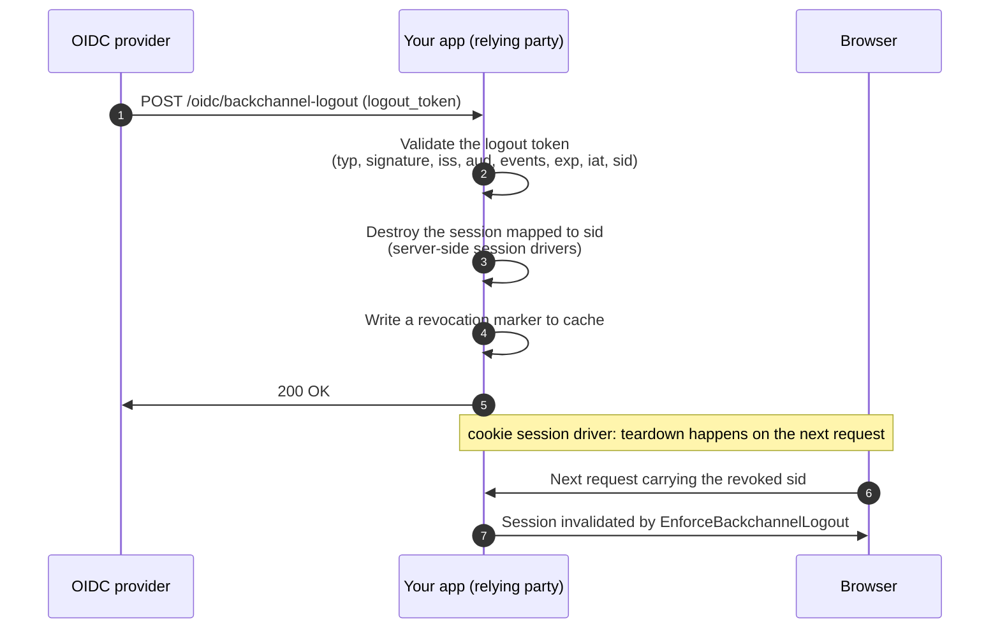

Back-channel logout lets the provider end this app's session **without the browser's
involvement** — when the user logs out at the provider (or their session expires there),
the provider POSTs a signed logout token directly to this app. It is **opt-in**:

```dotenv
OIDC_RP_BACKCHANNEL_LOGOUT_ENABLED=true
```

Enabling it registers `POST /oidc/backchannel-logout` and the enforcement middleware, and
starts recording the `sid` claim from each login's `id_token`.

You must register this endpoint as the client's `backchannel_logout_uri` at the provider —
providers only POST to URIs they know about. On a `laravel-oidc` provider that is a column
on the client (see the provider's [logout page](/provider/logout/)).

## How teardown works



Two mechanisms cooperate:

- **Immediate teardown.** At login the session id is stored in cache under the token's
  `sid`. When a logout token arrives, that session is destroyed directly through the
  session handler — the user is logged out before their next request.
- **The revocation marker.** Independently, a `revoked` marker is written to cache. The
  `EnforceBackchannelLogout` middleware checks it on every request and invalidates any
  session still carrying that `sid` — the safety net for the cookie session driver (where
  there is no server-side session to destroy) and for anything that outlived the direct
  teardown.

Both entries expire after `backchannel_logout.retention_minutes` (defaults to
`SESSION_LIFETIME`), after which the session itself has expired anyway.

:::caution[Storage requirements for immediate teardown]
Immediate teardown needs a **persistent cache store** (redis, database, file — not
`array`) and a **server-side session driver** (database, redis, file). With
`SESSION_DRIVER=cookie` only the middleware fallback applies: the session survives until
that browser's next request, then is invalidated.
:::

## Logout-token validation

The endpoint accepts only tokens that pass all of
[the spec's checks](https://openid.net/specs/openid-connect-backchannel-1_0.html):
a `logout+jwt` type header, an RS256 signature against the provider's JWKS, matching
`iss` and `aud`, the back-channel logout `events` claim, **no** `nonce`, a fresh
`iat`/valid `exp` (within leeway), and a non-empty `sid`. Anything else gets a `400
invalid_request`; the endpoint never reveals whether a session existed. It responds with
`Cache-Control: no-store` either way and is throttled (`throttle:60,1`).

## Placing the middleware yourself

`EnforceBackchannelLogout` is auto-appended to the `web` middleware group. Set
`oidc-client.backchannel_logout.auto_middleware` to `false` and use the
`oidc-client.enforce-logout` alias to scope it to a subset of routes instead:

```php
Route::middleware(['web', 'oidc-client.enforce-logout'])->group(function () {
    // ...
});
```
