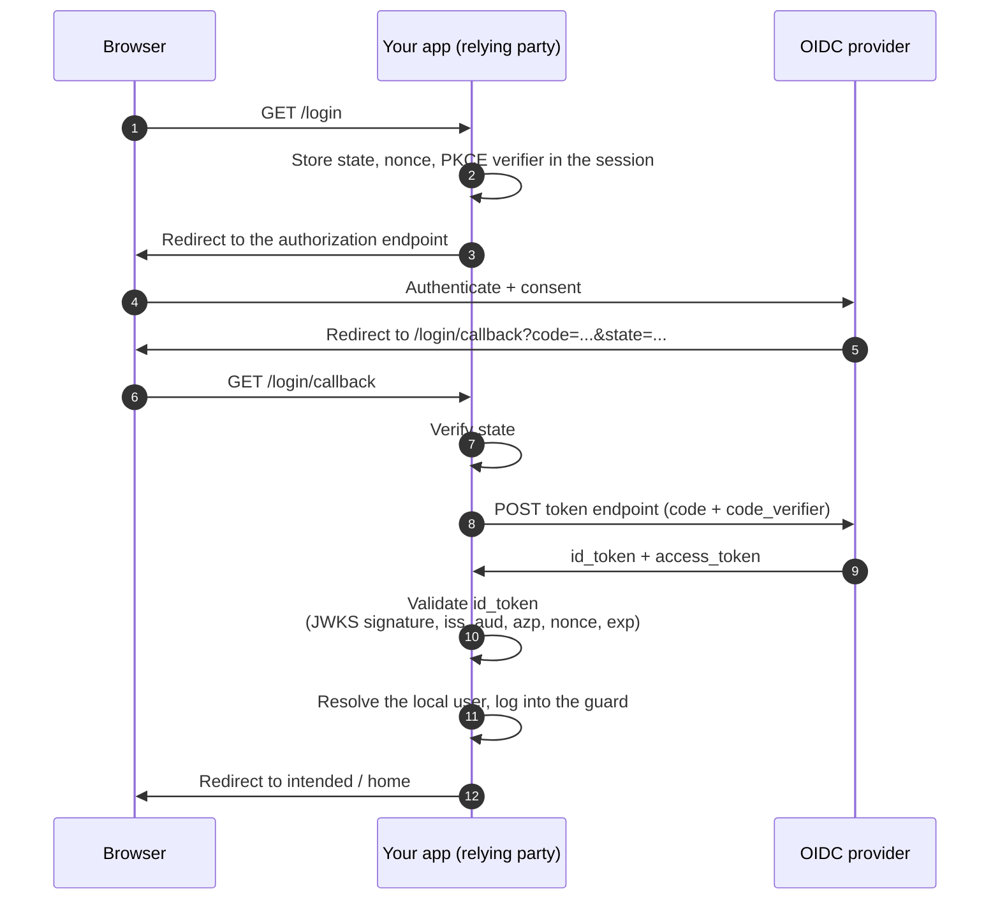

`bambamboole/laravel-oidc-client` turns a Laravel app into an **OpenID Connect relying
party**: it drives the Authorization Code + PKCE flow against any OIDC provider, strictly
validates the returned `id_token` against the provider's JWKS, and logs the resolved user
into a guard of your choosing.

It is the client-side companion to `bambamboole/laravel-oidc` (the provider these docs
belong to), but it works against **any** spec-compliant OIDC provider — Keycloak, Auth0,
Okta, Entra ID, or your own `laravel-oidc` instance for self-SSO.

The two are deliberately separate packages: an app that only needs to *consume* an
identity provider should not pull in a full OAuth2 authorization server, TOTP, QR codes,
and WebAuthn.

## The login flow

Every request uses PKCE (`S256`), a one-time `state`, and a one-time `nonce`; the callback
context is pulled from the session exactly once, so a replayed callback fails. See
[Login & logout](/client/login-and-logout/) for the full validation list.

## What it provides

- **Discovery-driven setup** — the provider's `/.well-known/openid-configuration` and JWKS
  are fetched and cached; an unknown `kid` triggers one fresh JWKS fetch, so provider
  [key rotation](/provider/key-rotation/) works without redeploying the client.
- **Strict `id_token` validation** — RS256 signature against JWKS, `iss`, `aud`, `azp`,
  `nonce`, `sub`, and `exp`/`nbf`/`iat` with configurable leeway.
- **A user-resolution seam** — map the token's `sub`/claims to a local user with
  `OidcClient::resolveUsersUsing(...)`, or fall back to the guard provider's
  `retrieveById($sub)`.
- **RP-initiated logout** — `POST /logout` ends the local session and forwards to the
  provider's end-session endpoint with `id_token_hint`.
- **Back-channel logout** — an opt-in endpoint that accepts logout tokens pushed by the
  provider and tears down the matching local session. See
  [Back-channel logout](/client/backchannel-logout/).

## Where to go next

- [Installation](/client/installation/) — install, enable, and register the client at the
  provider.
- [Configuration](/client/configuration/) — every `config/oidc-client.php` key, including
  the route handlers.
- [Login & logout](/client/login-and-logout/) — the flow in detail and the user-resolution
  seam.
- [Back-channel logout](/client/backchannel-logout/) — provider-pushed session teardown.
